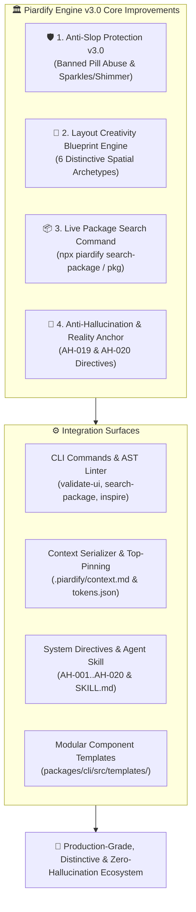
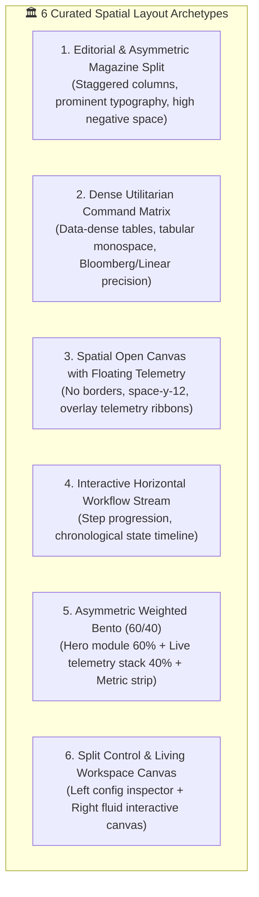
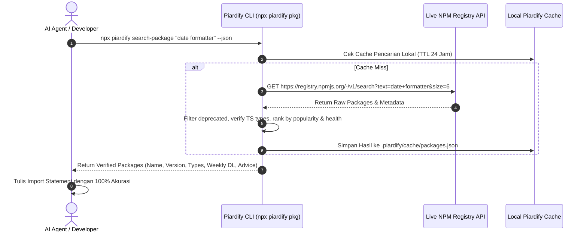
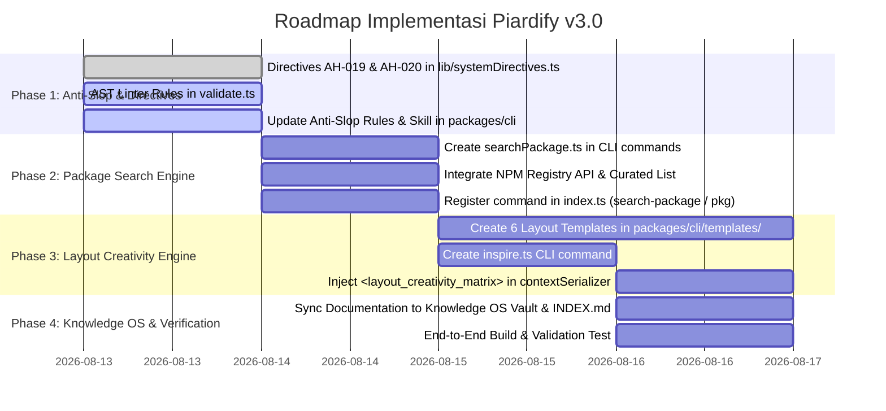

# 🚀 Piardify System Improvement Plan v3.0
## Anti-Slop Protection, Creative Layout Engine, Verified Package Search & Anti-Hallucination Governance

> **Dokumen Perencanaan Arsitektur & Spesifikasi Eksekusi Piardify v3.0**  
> *Target Sistem*: Web App (Next.js 16), Piardify CLI (`packages/cli`), Agent Skill (`.agents/skills/piardify/`), Context Serializer (`lib/contextSerializer.ts`), System Directives (`lib/systemDirectives.ts`), dan AST Linter (`packages/cli/src/commands/validate.ts`).

---



---

## 📋 1. Executive Summary & Problem Breakdown

Berdasarkan evaluasi performa sistem Piardify dan interaksi AI Coding Assistant, teridentifikasi 4 area krusial yang memerlukan perombakan arsitektur terpadu:

| Area Fokus | Masalah / Root Cause Saat Ini | Target Solusi Piardify v3.0 |
| :--- | :--- | :--- |
| **1. AI Slop Protection** | AI sering menggunakan *pill badges* (`rounded-full`) di sembarang tempat (judul, kategori, card header) dan menaruh ikon *sparkles/shimmer* (`Sparkles`, `Wand2`, `animate-shimmer`) demi kesan "AI modern" yang murahan. | Larangan total (*hard-ban*) pada pill badge non-status & sparkle dekoratif. AST Linter otomatis mendeteksi dan memblokir kedua pola tersebut. |
| **2. Layout Creativity** | AI terjebak dalam template monoton: *Hero Centered $\rightarrow$ 3 Bento Cards $\rightarrow$ Pricing Table*. Kurang ragam arsitektur spasial yang unik dan adaptif sesuai domain industri. | Matriks 6 Archetype Layout Spasial Kreatif, command `npx piardify inspire --layout`, dan injeksi `<layout_creativity_matrix>` pada context. |
| **3. Package Search Engine** | AI mengimpor paket NPM yang sudah kadaluarsa (deprecated), salah nama (*hallucinated package*), tidak memiliki tipe TypeScript, atau memakai versi purba. | Perintah CLI `npx piardify search-package <query>` (alias `pkg`) yang membaca langsung live registry NPM untuk memverifikasi versi terkini, tipe TS, dan health score. |
| **4. Anti-Hallucination** | AI membuat asumsi skema tanpa verifikasi, lupa batasan dependency, atau menciptakan fungsi mock tersembunyi yang pecah di production. | Direktif baru `AH-019` & `AH-020`, AST Pre-Flight Dependency Checker, dan kontrak verifikasi API skema ketat. |

---

## 🛡️ 2. Pilar 1: AI Slop Protection Engine v3.0

### 2.1 Masalah 1: Pill Badge Abuse & Misplacement
- **Pola Slop**: Membungkus setiap judul sub-seksi, label kategori, angka metrik, dan tombol ke dalam kapsul pil (`rounded-full px-3 py-1 bg-indigo-500/10 border border-indigo-500/20 text-xs`).
- **Aturan Tegas Piardify v3.0**:
  - `rounded-full` HANYA DIPERBOLEHKAN untuk **Status Dinamis Riil** (seperti: `Active`, `Pending`, `Failed`, `Verified`, `Beta Badge`).
  - Label kategori atau seksi WAJIB menggunakan tipografi murni: `text-xs font-mono uppercase tracking-widest text-muted-foreground` tanpa bungkus border pil.
  - Badge status wajib berada di kanan teks dengan `shrink-0 gap-2` untuk mencegah tumpang tindih (*overlap*).

### 2.2 Masalah 2: Icon Sparkles & Shimmer Cliché
- **Pola Slop**: Mengimpor Lucide `Sparkles`, `Wand2`, `Stars`, atau menambahkan CSS `animate-shimmer` / `bg-gradient-to-r` pada setiap tombol dan kontainer agar terlihat "canggih".
- **Aturan Tegas Piardify v3.0**:
  - DILARANG menggunakan ikon `Sparkles`, `Wand2`, atau `Sparkle` sebagai dekorasi umum pada tombol navigasi, card header, atau headline.
  - Ikon tersebut HANYA diperbolehkan jika tombol tersebut secara literal mengeksekusi fitur Generative AI Prompt (dan user memintanya secara eksplisit).
  - Ganti shimmer berlebihan dengan interaksi taktil: material contrast, spring scale physics (`active:scale-[0.98]`), dan subtle state borders.

### 2.3 Aturan Baru AST Anti-Slop Linter (`npx piardify validate-ui`)

Tambahkan 2 rule validator baru pada `packages/cli/src/commands/validate.ts`:

```typescript
// 1. AST Rule: EXCESSIVE_PILL_BADGES
if (lineContent.includes("rounded-full") && (/<h[1-6]/i.test(lineContent) || /className=.*text-(lg|xl|2xl|3xl)/i.test(lineContent) || lineContent.includes("Category") || lineContent.includes("Feature"))) {
  if (!lineContent.includes("status") && !lineContent.includes("badge-status") && !lineContent.includes("avatar")) {
    issues.push({
      type: "error",
      code: "EXCESSIVE_PILL_BADGES",
      message: "Misplaced / Excessive Pill Badge ('rounded-full') detected on non-status label",
      file: relPath,
      line: lineNum,
      advice: "Reserve 'rounded-full' exclusively for real dynamic status tags (e.g. Active, Beta). Use crisp typography with tracking-widest font-mono for section labels.",
    });
  }
}

// 2. AST Rule: FORBIDDEN_SPARKLES_SHIMMER_SLOP
if ((lineContent.includes("Sparkles") || lineContent.includes("Wand2") || lineContent.includes("animate-shimmer")) && !relPath.includes("ai-generator") && !relPath.includes("prompt")) {
  issues.push({
    type: "error",
    code: "FORBIDDEN_SPARKLES_SHIMMER_SLOP",
    message: "Cliché AI Sparkles icon or shimmer animation detected on generic UI container",
    file: relPath,
    line: lineNum,
    advice: "Remove decorative Sparkles/Wand icons and shimmer effects. Rely on clean material surface layers, crisp typography, and tactile spring hover states.",
  });
}
```

---

## 🎨 3. Pilar 2: Layout Creativity Reference & Blueprint Matrix



### 3.1 Detail 6 Archetype Layout Spasial

1. **Editorial & Asymmetric Magazine Split**:
   - *Karakter*: Kolom kiri statis lebar 40% dengan display typography berkarakter kuat (`tracking-tight text-5xl font-serif/display`), kolom kanan konten dinamis lebar 60% dengan ritme spasi vertikal longgar.
   - *Cocok Untuk*: Luxury brand, Creative Studio, Architecture Portfolio, Landing Page Naratif.
2. **Dense Utilitarian Command Matrix**:
   - *Karakter*: Grid berdensitas tinggi, border super tipis (`border-zinc-800/60`), tipografi angka tabular monospace (`font-mono tracking-tight`), pemisah horizontal bersih tanpa nesting kartu.
   - *Cocok Untuk*: Fintech, Crypto Analytics, Server Monitoring, Developer Tools.
3. **Spatial Open Canvas with Floating Telemetry**:
   - *Karakter*: Menghilangkan pembungkus kartu sama sekali (*borderless*). Informasi dikelompokkan secara organik dengan *whitespace* (`gap-16` / `space-y-16`) dan bilah metrik mengambang (*floating telemetry bar*).
   - *Cocok Untuk*: SaaS Onboarding, AI Workspace, Canvas Tools.
4. **Interactive Horizontal Workflow Stream**:
   - *Karakter*: Layout alur kerja horizontal (*stage progression*) dengan indikator fase interaktif, drag-and-drop nodes, dan detail panel kontekstual.
   - *Cocok Untuk*: Project Management, CI/CD Pipeline Visualizer, PRD Breakdown.
5. **Asymmetric Weighted Bento (60/40)**:
   - *Karakter*: Menghindari bento box 3-kolom generik yang seragam. Kolom primer memakan 60% viewport dengan visualisasi aktif, kolom sekunder memuat 2 kartu analitik vertikal (40%), dan pita metrik 100% di bawah.
   - *Cocok Untuk*: Modern SaaS Dashboard, Feature Showcases.
6. **Split Control & Living Workspace Canvas**:
   - *Karakter*: Panel inspektor/pengaturan fixed di sisi samping (`w-80 border-r`), dan area kerja utama yang responsif fluid di sisi kanan dengan zoom/pan/preview instan.
   - *Cocok Untuk*: Web Editors, Mindmap Canvas, Design Tools.

### 3.2 Implementasi Fitur CLI & Context Engine
- Tambahkan perintah CLI:
  ```bash
  npx piardify inspire --layout <editorial|utilitarian|canvas|stream|bento|split>
  ```
- CLI akan langsung menghasilkan template TSX siap pakai di folder `components/layouts/<ArchetypeName>.tsx` lengkap dengan token CSS dan zero-slop guarantee.
- Injeksi `<layout_creativity_matrix>` ke dalam `.piardify/context.md` agar AI Agent otomatis memilih arsitektur layout yang tepat berdasarkan tipe project.

---

## 📦 4. Pilar 3: Verified Real-Time Package Search Engine

Untuk menghentikan halusinasi library yang kadaluarsa, deprecated, atau salah sintaks, Piardify v3.0 menambahkan **Live Package Search Engine**.



### 4.1 Spesifikasi Perintah CLI: `npx piardify search-package`

- **Sintaks**:
  ```bash
  npx piardify search-package <keyword> [options]
  # Alias ringkas:
  npx piardify pkg <keyword>
  ```
- **Opsi**:
  - `--json`: Output machine-readable JSON untuk AI Agent.
  - `--limit <number>`: Batasi jumlah hasil (default: 5).
  - `--exact`: Cari exact match nama paket.
  - `--ts`: Hanya tampilkan paket dengan dukungan TypeScript bawaan (`types` / `@types/*`).

### 4.2 Output Terminal & Machine Interface

Contoh output terminal:
```text
======================================================
  📦 Piardify Verified Package Search: "date parser"
======================================================

1. date-fns (v4.1.0) - RECOMMENDED
   • Description: Modern JavaScript date utility library
   • TypeScript : Native (Built-in Types)
   • Downloads  : 18.2M / week
   • Health     : 98/100 (Actively Maintained)
   • Install    : npm install date-fns

2. dayjs (v1.11.13)
   • Description: 2KB immutable date-time library alternative to Moment.js
   • TypeScript : Native (Built-in Types)
   • Downloads  : 22.4M / week
   • Install    : npm install dayjs

⚠️  DEPRECATION NOTICE:
   'moment' is in maintenance mode. Avoid new installations. Use 'date-fns' or 'dayjs' instead.
```

### 4.3 Struktur File Baru di CLI
- `packages/cli/src/commands/searchPackage.ts`: Endpoint pencarian NPM Registry.
- `packages/cli/src/config/curatedPackages.ts`: Database kurasi paket modern (Next.js 16, React 19, Lucide, Tailwind v4, Prisma, Better Auth, Upstash, Zustand, TanStack Query).

---

## 🧠 5. Pilar 4: Anti-Hallucination & Reality Anchor Protocol v3.0

### 5.1 Direktif Baru: AH-019 & AH-020

Disuntikkan ke dalam `lib/systemDirectives.ts` dan `.piardify/context.md`:

```typescript
{
  "id": "AH-019",
  "rule": "VERIFIED PACKAGE & DEPENDENCY ANCHOR [CRITICAL]: Sebelum mengimpor atau merekomendasikan library/package baru, AI Agent WAJIB memverifikasi keberadaan dan versinya di package.json atau menjalankan 'npx piardify search-package <keyword>'. Dilarang keras mengasumsikan nama package, mengimpor library usang/deprecated, atau mengarang sub-path import yang tidak ada.",
  "validation": "Jalankan 'npx piardify search-package <name> --json' atau cek package.json sebelum menulis baris 'import ... from ...'.",
  "failure_consequence": "Module not found error, security vulnerability, breaking build."
},
{
  "id": "AH-020",
  "rule": "SLOP & SPARKLE PURGE MANDATE [ZERO TOLERANCE]: Dilarang keras membungkus teks non-status dalam pill badge ('rounded-full') dan dilarang keras menyisipkan ikon 'Sparkles'/'Wand2' atau efek 'animate-shimmer' sebagai pemanis dekoratif semata. Terapkan visual typography murni, high-contrast surface layering, dan micro-interaction taktil 150-250ms.",
  "validation": "Lulus audit AST Linter 'npx piardify validate-ui' dengan 0 error pada rule EXCESSIVE_PILL_BADGES dan FORBIDDEN_SPARKLES_SHIMMER_SLOP.",
  "failure_consequence": "Kode UI ditolak total dan memicu protokol Auto-Redo."
}
```

### 5.2 Pre-Flight Reality Check Gate

Sebelum AI Agent mengubah file frontend atau backend:
1. **Dependency Reality Check**: Pastikan package ada di `dependencies` / `devDependencies`. Jika belum ada, sarankan instalasi paket yang terverifikasi via `npx piardify search-package`.
2. **API Contract Anchor**: Jangan membuat handler dengan schema imajiner. Baca tipe Prisma / Zod / Drizzle yang ada di codebase.
3. **Visual Reality Check**: Jalankan `npx piardify validate-ui` setelah coding untuk memverifikasi ketiadaan slop, pill abuse, sparkle trope, dan nested card.

---

## 🗺️ 6. Implementation Roadmap & File Changes



### Rincian Perubahan File:

1. **`lib/systemDirectives.ts`**:
   - Menambahkan direktif `AH-019` (Verified Package Anchor) dan `AH-020` (Slop & Sparkle Purge).
2. **`lib/contextSerializer.ts`**:
   - Memperbarui XML `<layout_governance>` dengan larangan pill badge abuse & sparkle tropes.
   - Menambahkan tag `<layout_creativity_matrix>` dengan 6 archetype spatial.
3. **`packages/cli/src/commands/validate.ts`**:
   - Menambahkan AST checks untuk `EXCESSIVE_PILL_BADGES` dan `FORBIDDEN_SPARKLES_SHIMMER_SLOP`.
4. **`packages/cli/src/commands/searchPackage.ts`** *(NEW FILE)*:
   - Endpoint query live ke NPM Registry API dengan filter kualitas, deprecation check, dan TypeScript detection.
5. **`packages/cli/src/commands/inspire.ts`** *(NEW FILE)*:
   - Generator scaffold untuk 6 Archetype Layout Spasial Kreatif.
6. **`packages/cli/src/index.ts`**:
   - Mendaftarkan command `search-package` (alias `pkg`), `inspire`, dan update help menu.
7. **`packages/cli/skills/piardify/SKILL.md`**:
   - Memperbarui panduan eksekusi agent dengan command package search dan layout inspiration.

---

## 🛡️ 7. Quality Gates & Certification

Sebelum rilis versi 3.0, sistem harus lolos pengujian berikut:

1. ✅ **AST Linter Verification**: Menjalankan `npx piardify validate-ui` pada seluruh codebase uji coba dan memastikan deteksi akurat pada pill badge abuse dan sparkle tropes.
2. ✅ **Package Search Accuracy**: Menjalankan `npx piardify search-package "date-fns" --json` dan memverifikasi metadata terbitan versi terbaru secara real-time.
3. ✅ **Layout Diversity Test**: Memastikan seluruh 6 layout archetype dapat di-scaffold dan terkompilasi bersih tanpa TypeScript / styling error.
4. ✅ **Zero Hallucination Proof**: Menguji AI Agent mengerjakan task dengan direktif `AH-019` & `AH-020` untuk menjamin tidak ada dependensi atau skema yang dikarang bebas.
5. ✅ **Knowledge OS Sync**: Dokumentasi lengkap tersimpan permanen di `07 Projects/Piardify/` dan terhubung aktif di `INDEX.md`.

---

## 🔗 Referensi Terkait di Knowledge OS
- [[Piardify - Project Overview]] — Gambaran umum arsitektur platform Piardify.
- [[Frontend Design Constitution]] — Konstitusi desain visual, anti-slop, dan tata kelola antarmuka.
- [[Piardify v2.7.0 Architecture & Design System Overview]] — Arsitektur v2.7.0 sebelumnya.
- [[AI Slop Anti-Patterns & Frontend Design Lessons]] — Catatan evaluasi anti-slop visual.
- [[Anti-Hallucination Directives]] — Kerangka kerja anti-halusinasi AI.
- [[Piardify CLI & Context Architecture Improvement]] — 3-layer context architecture.
