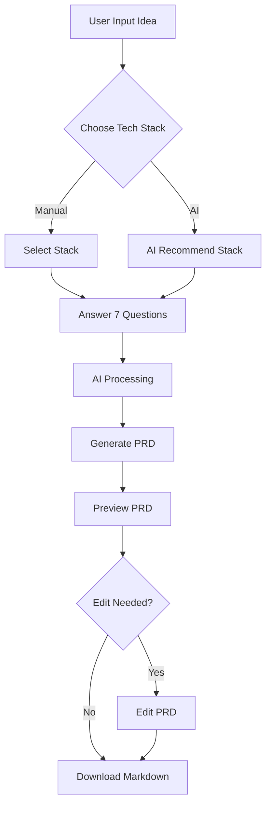
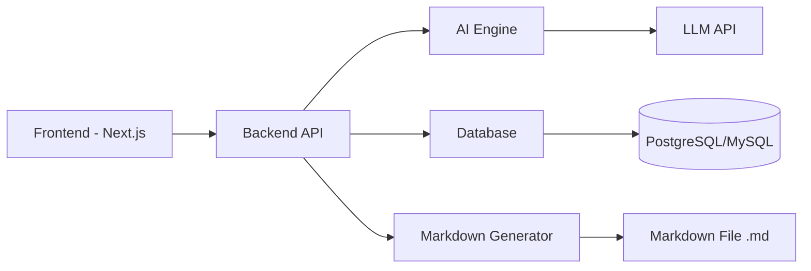
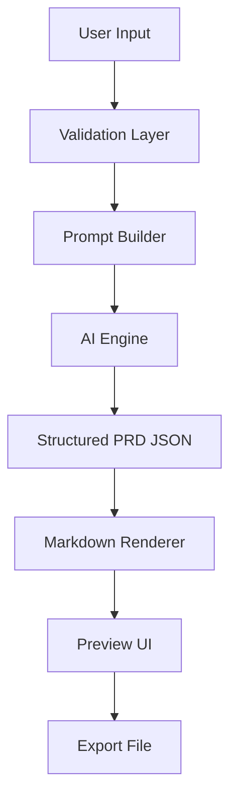
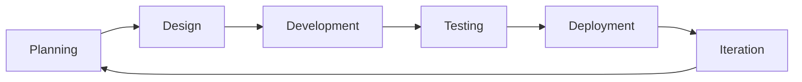

# PRODUCT REQUIREMENTS DOCUMENT (PRD)

## Moryn — AI PRD Generator Platform

---

## 1. Overview

**Moryn** adalah aplikasi berbasis AI yang memungkinkan pengguna menghasilkan Product Requirements Document (PRD) secara otomatis, terstruktur, dan minim halusinasi.

Platform ini membantu developer, product manager, dan mahasiswa dalam membuat dokumentasi produk dengan cepat, akurat, dan profesional.

---

## 2. Objectives

### Primary Goals

- Menghasilkan PRD otomatis berbasis AI
- Mengurangi halusinasi AI
- Menyediakan struktur PRD profesional
- Mempercepat workflow dokumentasi

### Success Metrics

- ≥ 90% PRD selesai dalam < 3 menit
- ≥ 80% tanpa revisi besar
- Retention ≥ 40%

---

## 3. Target Users

### Mahasiswa IT

- Membutuhkan dokumentasi tugas/proyek
- Kurang memahami struktur PRD

### Developer

- Membutuhkan dokumentasi sebelum development

### Startup Founder

- Validasi ide sebelum membangun produk

---

## 4. Features

### 4.1 AI PRD Generator

- Input: ide aplikasi
- Output: PRD lengkap terstruktur (dalam format Markdown)

### 4.2 Tech Stack Selection

- Manual selection: Memilih framework/bahasa untuk Frontend, Backend, Database, dan Deployment.
- AI recommendation: Rekomendasi otomatis berbasis ide produk.

### 4.3 7-Step Personalization (Anti Halusinasi)

Mewajibkan user menjawab 7 pertanyaan terarah sebelum generate PRD:
1. Target user
2. Platform (web/mobile)
3. Core features
4. Monetisasi
5. Skala aplikasi
6. Integrasi pihak ketiga
7. Design preference

### 4.4 PRD Preview & Markdown Editor

- Mode Baca: Real-time Markdown preview
- Mode Edit: Teks editor (textarea) mentah untuk melakukan perubahan kustom secara cepat.

### 4.5 Visual Graph Mindmap Editor

- Visual Mindmap yang merepresentasikan arsitektur produk dalam bentuk pohon hirarki (Root -> Kategori -> Sub-fitur).
- **Interactive Editing**: Pengguna dapat menggeser node, mengganti teks judul secara langsung (*inline-edit*), menambah node baru (*Category* / *Leaf*), serta menghubungkan garis (*edge*) antar node secara visual.
- **Visual-to-JSON Parser**: Diagram visual secara cerdas di-*reverse-engineer* kembali menjadi bentuk skema JSON terstruktur saat disimpan.

### 4.6 Smart Task Sync Engine

- Membagi modul arsitektur menjadi daftar Task yang dapat ditandai selesai (*checklist*).
- **Smart Sync**: Ketika pengguna mengedit PRD atau Struktur, sistem akan menandai task sebagai *outdated* (`_tasksOutdated: true`). Saat masuk halaman Task, AI hanya akan menyelaraskan dan memperbarui task pada bagian yang berubah saja tanpa menulis ulang task lain. Ini menghemat kuota token AI secara drastis.

### 4.7 Gamification & EXP System

- Setiap kali sebuah project diselesaikan (semua task selesai), pengguna mendapatkan +100 EXP.
- Peningkatan Rank berdasarkan akumulasi EXP dengan icon Lucide yang representatif (Sprout, Compass, PenLine, LayoutList, Lightbulb, Map, Timer, Telescope, Trophy, Wrench).

### 4.8 Monthly Plan Limits

Membatasi kuota pembuatan project bulanan:
- **Plan Free**: 1x generate project per bulan.
- **Plan Pro**: 3x generate project per bulan.

---

## 5. User Flow

---

## 6. System Architecture

---

## 7. Data Flow

---

## 8. Tech Stack

### Frontend

- Next.js
- Tailwind CSS & Vanilla CSS (custom design tokens)
- @xyflow/react (React Flow untuk Diagram Mindmap Interaktif)
- Lucide React (ikonografi)

### Backend

- Next JS API Routes

### AI Engine

- Gemini API / LLM

### Database

- PostgreSQL (prisma ORM online by vercel)

### Storage

- JSON (PRD structure)
- Markdown file

---

## 9. Design Guidelines

### Style

- Clean
- Modern
- Developer-friendly

### UI Principles

- High readability
- Clear hierarchy
- Minimal distraction
- Modern and Eye Catching

### Theme

- Dark Mode (default)
- Accent: Indigo / Blue

---

## 10. Development Process Flow

---

## 11. Constraints & Risks

### Constraints

- AI hallucination
- API cost
- Latency

### Risks

- Output terlalu generic
- User input tidak jelas

### Mitigation

- 7-step personalization
- Prompt engineering
- Validation system

---

## 12. Future Enhancements

- Multi-user collaboration
- PRD versioning
- Export ke PDF / DOCX
- Integrasi Jira / Trello
- Custom AI model

---

## 13. Unique Value Proposition

- PRD otomatis dalam hitungan menit
- Minim halusinasi dibanding AI biasa
- Visual + dokumentasi dalam satu platform
- Developer-focused workflow

---

## 14. Conclusion

Moryn memberikan solusi cepat, akurat, dan terstruktur untuk pembuatan PRD tanpa memerlukan pengalaman mendalam dalam product documentation.
