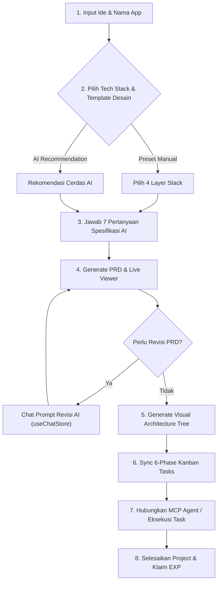
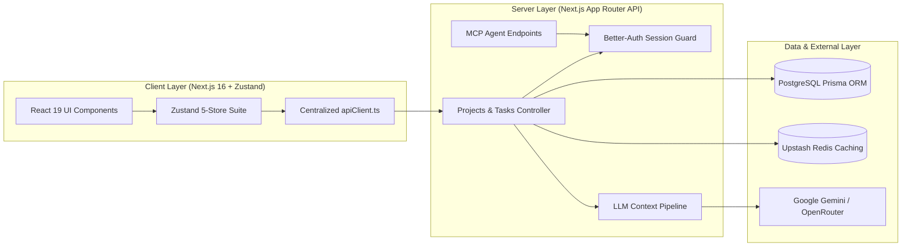
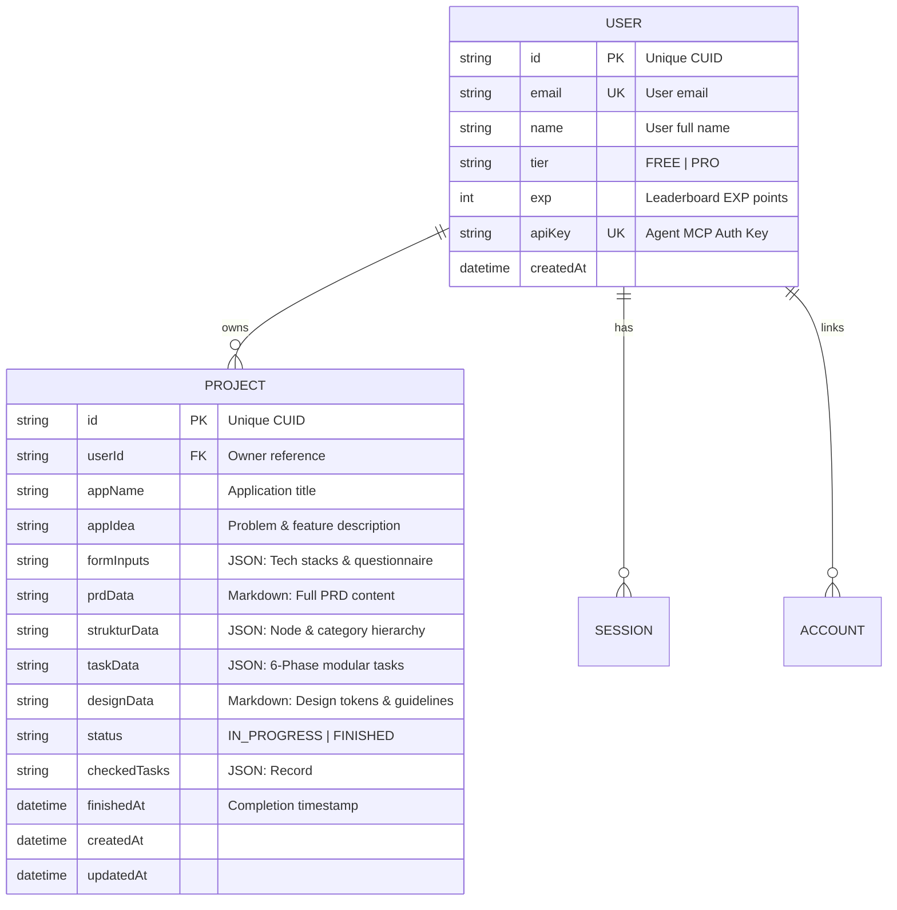

# Product Requirements Document (PRD)

## Moryn — AI-Powered PRD & Architecture Engine

---

## 1. Overview & Objectives

### 1.1 Product Summary
**Moryn** adalah platform otomasi rekayasa perangkat lunak yang mengubah ide produk mentah menjadi **Product Requirements Document (PRD)**, diagram arsitektur interaktif (*React Flow Architecture Tree*), spesifikasi desain (*design.md*), dan daftar tugas teknis (*6-Phase Kanban Tasks*) yang presisi dan siap dieksekusi tanpa halusinasi.

### 1.2 Core Problem & Solution
* **Problem**: Menyusun dokumentasi teknis, memetakan arsitektur file, dan memecahnya menjadi daftar task siap eksekusi membutuhkan waktu berhari-hari. Generator AI generik sering berhalusinasi dan menghasilkan spesifikasi yang tidak konsisten antar komponen.
* **Solution**: Pipeline berantai 4 tahap terikat (*Contextual Chaining Pipeline*): Kuesioner Personal $\rightarrow$ PRD $\rightarrow$ Visual Tree $\rightarrow$ 6-Phase Task List.

### 1.3 Success Metrics (KPIs)
* Waktu generasi end-to-end $< 3$ menit per project.
* $\ge 95\%$ konsistensi konteks antara PRD, struktur folder/diagram, dan daftar tugas Kanban.
* Zero build errors pada scaffold kode dan integrasi MCP Agent.

---

## 2. User Personas & Pain Points

### 2.1 Software Engineers / Solo Developers
* **Pain Point**: Dokumentasi teknis memakan waktu; kesulitan memecah PRD abstrak menjadi task teknis atomik; output AI generik sering menghasilkan nama file yang inkonsisten.
* **Solution**: Auto-scaffolding arsitektur folder, visual tree, dan breakdown task 6 fase yang langsung sinkron dengan MCP Agent di IDE (Cursor, Windsurf, Antigravity).

### 2.2 Product Managers & Technical Founders
* **Pain Point**: Kesulitan mengomunikasikan ide bisnis abstrak menjadi arsitektur teknis bagi developer; draf revisi sering hilang saat navigasi tab.
* **Solution**: Editor PRD interaktif dengan auto-save draf lokal, visual mindmap yang bisa diedit langsung, dan preview token desain.

---

## 3. End-to-End User Flow & Journey

---

## 4. Functional Requirements & Feature Matrix

| ID | Modul Fitur | User Story & Fungsionalitas | Kriteria Keberhasilan (Acceptance Criteria) |
| :--- | :--- | :--- | :--- |
| **FR-01** | **Multi-Step Generator** | Sebagai user, saya ingin mengisi ide produk secara bertahap dengan auto-save draf. | Draf ide & jawaban kuesioner tersimpan otomatis di `localStorage` via Zustand `persist` dan tidak hilang saat refresh. |
| **FR-02** | **7-Step Contextual AI** | Sebagai user, saya ingin menjawab 7 pertanyaan terarah yang relevan dengan domain ide saya. | AI menghasilkan 7 pertanyaan spesifik domain; jawaban diikat sebagai konteks permanen generasi PRD. |
| **FR-03** | **Interactive PRD Editor** | Sebagai user, saya ingin merevisi bagian PRD tertentu melalui chat instruksi interaktif. | PRD Markdown terbarui secara inkremental tanpa merusak struktur bab yang tidak diubah. |
| **FR-04** | **Visual Architecture Tree** | Sebagai user, saya ingin melihat dan mengedit diagram pohon arsitektur produk (*React Flow*). | Node dapat digeser, ditambahkan, dihapus, dan di-reverse engineer otomatis ke format JSON terstruktur. |
| **FR-05** | **Smart Task Synchronizer** | Sebagai developer, saya ingin modul arsitektur dipecah menjadi 6 fase pengerjaan modular. | Tasks otomatis dikelompokkan ke 6 fase; perubahan PRD/Struktur menandai task lama untuk disinkronkan ulang. |
| **FR-06** | **Reactive Kanban Board** | Sebagai developer, saya ingin menggeser status task (*Todo, In Progress, Done*) secara instan. | Pergeseran kartu task responsif (0ms lag) dan status live disinkronkan ke server secara background. |
| **FR-07** | **Gamification & EXP Engine**| Sebagai user, saya ingin mendapatkan reward EXP saat menyelesaikan project. | +100 EXP ditambahkan ke profil user dan memperbarui status ranking leaderboard publik. |
| **FR-08** | **MCP Agent Server** | Sebagai developer, saya ingin menghubungkan Cursor/Windsurf/Antigravity ke project via API Key. | Endpoint MCP menyediakan tools `get_project_context`, `list_tasks`, dan `update_task_status`. |
| **FR-09** | **CLI Template Studio** | Sebagai developer, saya ingin menginspeksi dan men-scaffold template kode Anti-Slop. | Showcase interaktif dengan preview responsif (Desktop/Tablet/Mobile), view TSX code, AI Prompt, dan perintah CLI. |

---

## 5. System Architecture & Component Interactions

---

## 6. API Specifications & Data Contracts

| Method | Endpoint Path | Request Payload Schema | Expected 200 Response Schema |
| :--- | :--- | :--- | :--- |
| `POST` | `/api/projects/create` | `{ appName: string, appIdea: string, stacks: object, dynamicAnswers: object }` | `{ projectId: string }` |
| `GET` | `/api/projects/detail` | `?projectId=string` | `{ project: ProjectDetailData }` |
| `POST` | `/api/projects/update` | `{ projectId: string, prdData?: string, strukturData?: object, taskData?: object }` | `{ success: boolean }` |
| `POST` | `/api/generate/prd` | `{ projectId: string }` | `{ markdown: string }` |
| `POST` | `/api/generate/edit-prd`| `{ projectId: string, currentPrd: string, prompt: string, selectedModel?: string }`| `{ updatedMarkdown: string, diffSummary: string }` |
| `POST` | `/api/generate/struktur`| `{ projectId: string }` | `{ title: string, description: string, nodes: Array }` |
| `POST` | `/api/generate/tasks` | `{ projectId: string, forceSync?: boolean }` | `{ phases: Array, savedStatus: object }` |
| `POST` | `/api/projects/finish` | `{ projectId: string, checkedTasks: object }` | `{ success: boolean, expGained: number, newExp: number }` |

---

## 7. Data Model & Database Schema

---

## 8. Tech Stack, State Management & Architecture

* **Core Framework**: Next.js 16 (Turbopack, App Router), React 19, TypeScript.
* **Component Architecture (`app/components/`)**:
  * `layout/`: Shell, Topbar, StepNavbar, Footer, ProjectHeaderBrand.
  * `landing/`: HeroSection, FeaturesSection, HowItWorksSection, LeaderboardSection, PricingSection, CtaSection.
  * `modals/`: ExamplePrdModal, McpConnectModal, UpgradeModal.
  * `shared/`: MarkdownRenderer, Skeleton suite.
  * `ai/`: Specialized AI message stream and Markdown blocks.
  * `showcase/`: CLI Template Studio workbench subcomponents.
* **Global State Management (Zustand 5-Store Suite)**:
  * `useProjectStore`: Caching project aktif di memori client untuk navigasi 0ms antar tab.
  * `useChatStore`: Riwayat chat revisi AI dan preferensi model yang persisten.
  * `useWizardStore`: Draf multi-step generator dengan auto-save `localStorage`.
  * `useKanbanStore`: Drag-and-drop responsif dan sinkronisasi task status.
  * `useUiStore`: Kontrol modal global (MCP, Rename, Upgrade).
* **Database & ORM**: PostgreSQL dengan Prisma ORM v6 (menggunakan composite index `[userId, createdAt]` dan compound unique `[id, userId]`).
* **Caching & Rate Limiting**: Upstash Redis (Fail-open sliding window rate limiting & 30s SWR TTL cache).
* **AI & LLM Services**: Google GenAI SDK (`@google/genai` Gemini 2.5/3.7) & OpenRouter API.
* **Authentication**: Better-Auth (HTTP-Only Secure Cookie Session).

---

## 9. Non-Functional Requirements & Security Guidelines

* **Performance & Latency SLAs**:
  * Initial page load: $\le 1.5$ detik.
  * Navigasi antar step berkat Zustand memory cache: **0ms network delay**.
* **Security & Access Control**:
  * Autentikasi ketat pada seluruh endpoint mutasi data (`/api/projects/*`, `/api/generate/*`).
  * Compound query `where: { id_userId: { id, userId } }` menjamin user hanya dapat mengakses project miliknya.
  * Rate-limiting per user untuk mencegah eksploitasi kuota API LLM.
* **Design System Reference**:
  * Seluruh token warna (HEX/HSL), hirarki tipografi, dan aturan komponen UI mengacu secara ketat pada spesifikasi berkas `design.md` (`designData`).

---

## 10. Implementation Roadmap & Milestones

* **Phase 1: Database, Auth & Global Layout Infrastructure**
  * Setup PostgreSQL, Prisma schema indexes, Better-Auth session, dan Upstash Redis rate-limiter.
  * Implementasi layout dasar: `Navbar`, `Footer`, dan shell navigasi utama.
* **Phase 2: Zustand 5-Store Suite, Centralized API Client & Shared UI**
  * Implementasi centralized service layer `lib/utils/apiClient.ts`.
  * Setup 5 store Zustand (`useProjectStore`, `useChatStore`, `useWizardStore`, `useKanbanStore`, `useUiStore`).
  * Pembuatan suite komponen feedback (`Skeletons`, `MarkdownRenderer`).
* **Phase 3: Multi-Step Generator & 7-Step Contextual Questionnaire**
  * UI Wizard interaktif 3-step dengan auto-save `localStorage` draf via `useWizardStore`.
  * Integrasi prompt AI generator 7 pertanyaan dinamis sesuai domain ide produk.
* **Phase 4: PRD Engine, Live Markdown Viewer & Interactive Chat Editor**
  * Pipeline generasi PRD Markdown berbasis *Contextual Chaining*.
  * Viewer PRD interaktif dengan Table of Contents (TOC) otomatis dan panel chat revisi real-time (`/api/generate/edit-prd`).
* **Phase 5: Visual Architecture Tree & Smart Task Synchronization**
  * Visual Mindmap interaktif (*React Flow*) dengan pengelompokan node per fase.
  * Algoritma generator task otomatis yang memecah arsitektur menjadi 6-fase Kanban board dengan status persistensi.
* **Phase 6: Gamification, MCP Agent Server & CLI Template Studio Hardening**
  * Sistem reward EXP (+100 EXP per project) dan sinkronisasi ranking leaderboard publik.
  * Endpoint MCP Server (`/api/mcp`) untuk koneksi AI Coding Agent di IDE eksternal.
  * Showcase workbench template studio (`/components`) dengan preview multi-viewport.
