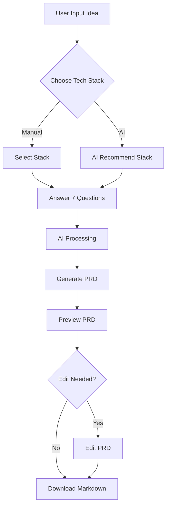
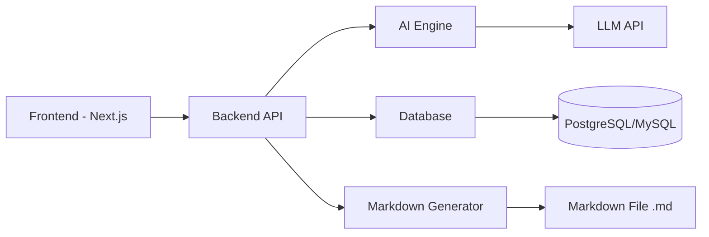
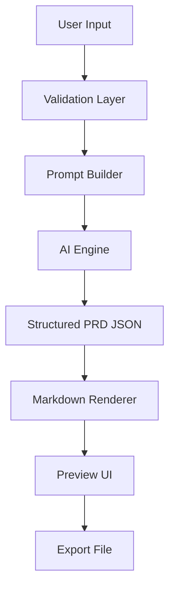
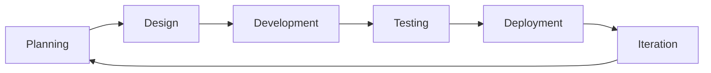

# PRODUCT REQUIREMENTS DOCUMENT (PRD)

## Piardify — AI PRD Generator Platform

---

## 1. Overview

**Piardify** adalah aplikasi berbasis AI yang memungkinkan pengguna menghasilkan Product Requirements Document (PRD) secara otomatis, terstruktur, dan minim halusinasi.

Platform ini membantu developer, product manager, dan mahasiswa dalam membuat dokumentasi produk dengan cepat, akurat, dan profesional.

---

## 2. Objectives

### Primary Goals

- Menghasilkan PRD otomatis berbasis AI
- Mengurangi halusinasi AI
- Menyediakan struktur PRD profesional
- Mempercepat workflow dokumentasi

### Success Metrics

- ≥ 90% PRD selesai dalam < 3 menit
- ≥ 80% tanpa revisi besar
- Retention ≥ 40%

---

## 3. User Personas & Problems

### 3.1 Mahasiswa IT / CS

- **Latar Belakang**: Mahasiswa yang sedang menyusun tugas akhir, skripsi, atau proyek mata kuliah.
- **Masalah Utama (Pain Points)**:
  - Kesulitan menyusun dokumen PRD berstandar industri dari nol.
  - Bingung menentukan *tech stack* dan arsitektur produk yang tepat.
  - Membutuhkan waktu lama untuk membuat dokumentasi teknis secara manual.

### 3.2 Software Developer

- **Latar Belakang**: Engineer / Solo Developer yang membangun proyek sampingan (*side-project*) atau MVP.
- **Masalah Utama (Pain Points)**:
  - Dokumentasi teknis sering terabaikan karena memakan waktu development.
  - Kesulitan memecah spesifikasi PRD menjadi daftar *task* teknis yang modular.
  - Hasil AI generatif biasa sering mengalami halusinasi dan spesifikasi tidak konsisten.

### 3.3 Startup Founder & Product Manager

- **Latar Belakang**: Non-technical founder atau Product Manager yang sedang memvalidasi ide produk baru.
- **Masalah Utama (Pain Points)**:
  - Sulit mengomunikasikan ide bisnis abstrak menjadi spesifikasi teknis untuk tim developer.
  - Menyusun spesifikasi produk dari nol memakan waktu berminggu-minggu.
  - Kurangnya alat visual untuk mengedit hirarki fitur secara cepat dan fleksibel.

---

## 4. Features

| Modul Fitur | Deskripsi & Fungsionalitas | Komponen / Detail Utama |
| :--- | :--- | :--- |
| **4.1 AI PRD Generator** | Generator otomatis untuk membuat dokumen PRD terstruktur dari masukan ide pengguna. | • **Input**: Ide aplikasi • **Output**: PRD Markdown terstruktur lengkap |
| **4.2 Tech Stack Selection** | Modul penentuan *tech stack* aplikasi berbasis pilihan manual atau rekomendasi AI. | • **Manual Selection**: Frontend, Backend, Database, Deployment • **AI Recommendation**: Rekomendasi cerdas berbasis ide produk |
| **4.3 7-Step Personalization** | Kuesioner 7 langkah terarah untuk memastikan akurasi konteks (Anti-Halusinasi). | 1. Target user & Platform (Web/Mobile) 2. Core features & Monetisasi 3. Skala aplikasi, Integrasi 3rd party, & Preferensi desain |
| **4.4 PRD Preview & Editor** | Antarmuka ganda untuk membaca pratinjau dan menyunting isi dokumen PRD. | • **Mode Baca**: Real-time Markdown preview • **Mode Edit**: Raw text editor untuk penyesuaian kustom cepat |
| **4.5 Visual Graph Mindmap** | Editor mindmap arsitektur produk visual interaktif berbentuk pohon hirarki (*Root -> Kategori -> Sub-fitur*). | • **Interactive Editing**: Drag node, inline-edit judul, tambah node/edge visual • **Visual-to-JSON Parser**: Auto reverse-engineer diagram ke skema JSON |
| **4.6 Smart Task Sync Engine** | Pembagian modul arsitektur menjadi daftar task *checklist* dengan penghematan token. | • **Checklist Task**: Pembagian kerja modular terstruktur • **Smart Sync**: AI hanya menyelaraskan task pada bagian yang berubah (`_tasksOutdated: true`) |
| **4.7 Gamification & EXP System** | Sistem akumulasi EXP dan kenaikan peringkat (*rank*) berbasis penyelesaian proyek. | • **EXP Reward**: +100 EXP per proyek yang diselesaikan • **Rank Progression**: Peningkatan peringkat disertai ikon Lucide representatif |
| **4.8 Monthly Plan Limits** | Pembatasan kuota pembuatan proyek bulanan berdasarkan tingkat langganan. | • **Plan Free**: 1x generate project per bulan • **Plan Pro**: 3x generate project per bulan |

---

## 5. User Flow

---

## 6. System Architecture

---

## 7. Data Flow

---

## 8. Tech Stack

### Frontend

- Next.js
- Tailwind CSS & Vanilla CSS (custom design tokens)
- @xyflow/react (React Flow untuk Diagram Mindmap Interaktif)
- Lucide React (ikonografi)

### Backend

- Next JS API Routes

### AI Engine

- Gemini API / LLM

### Database

- PostgreSQL (prisma ORM online by vercel)

### Storage

- JSON (PRD structure)
- Markdown file

---

## 9. Design Guidelines

### 9.1 General Aesthetics

- **Style**: Ultra-clean, modern enterprise dark-mode, developer-first.
- **UI Principles**: High readability, clear visual hierarchy, minimal clutter, micro-animations for high polish.
- **Anti AI-Slop Guarantee**: Menggunakan palet warna terkurasi khusus (HSL/Hex), glassmorphism berlapis, border glowing halus, dan tipografi modern (bukan bawaan browser polos).

### 9.2 Design Tokens & Color Palette

| Token Category | Token Name | Value / HEX / CSS | Penggunaan |
| :--- | :--- | :--- | :--- |
| **Background** | `bg-base` | `#0a0c18` | Latar belakang halaman utama |
| **Background** | `bg-surface` | `#0f1223` / `rgba(15,18,35,0.95)` | Panel, sidebar, dan container kartu |
| **Background** | `bg-elevated` | `rgba(255,255,255,0.04)` | Modal, dropdown option, dan popover |
| **Borders** | `border-subtle` | `rgba(99,102,241,0.15)` | Garis batas elemen & pembatas antar section |
| **Borders** | `border-glow` | `rgba(99,102,241,0.45)` | Status active / focus state pada input & button |
| **Accent Primary** | `accent-indigo` | `#6366f1` | Tombol aksi utama, indikator aktif |
| **Accent Glow** | `accent-gradient` | `linear-gradient(135deg, #6366f1, #a78bfa)` | Header badge, CTA button, glowing icons |
| **Typography** | `font-sans` | `'Inter'`, `'Outfit'`, sans-serif | Teks UI, judul, paragraf |
| **Typography** | `font-mono` | `'Geist Mono'`, `'Fira Code'`, monospace | Kode, token JSON, dan syntax highlight |
| **Effects** | `glass-blur` | `backdrop-filter: blur(16px)` | Floating panel, chat drawer, sticky headers |
| **Animations** | `micro-transition` | `all 0.25s cubic-bezier(0.4, 0, 0.2, 1)` | Hover state, tab active indicator, modal fade |

### 9.3 Typography & Component Tokens

- **Heading 1**: `2rem` (32px), Font-weight 800, Color `#f8fafc`, Bottom border `1px solid rgba(99,102,241,0.15)`
- **Heading 2**: `1.3rem` (20.8px), Font-weight 700, Color `#f1f5f9`
- **Heading 3**: `1.05rem` (16.8px), Font-weight 600, Color `#a5b4fc`
- **Body Text**: `14px`, Line-height 1.7, Color `#cbd5e1`
- **Code Pill**: Background `rgba(99,102,241,0.18)`, Border `rgba(99,102,241,0.28)`, Text `#c084fc`

---

## 10. Development Process Flow

---

## 11. Constraints & Risks

### Constraints

- AI hallucination
- API cost
- Latency

### Risks

- Output terlalu generic
- User input tidak jelas

### Mitigation

- 7-step personalization
- Prompt engineering
- Validation system

---

## 12. Future Enhancements

- Multi-user collaboration
- PRD versioning
- Export ke PDF / DOCX
- Integrasi Jira / Trello
- Custom AI model

---

## 13. Unique Value Proposition

- PRD otomatis dalam hitungan menit
- Minim halusinasi dibanding AI biasa
- Visual + dokumentasi dalam satu platform
- Developer-focused workflow

---

## 14. Conclusion

Piardify memberikan solusi cepat, akurat, dan terstruktur untuk pembuatan PRD tanpa memerlukan pengalaman mendalam dalam product documentation.
